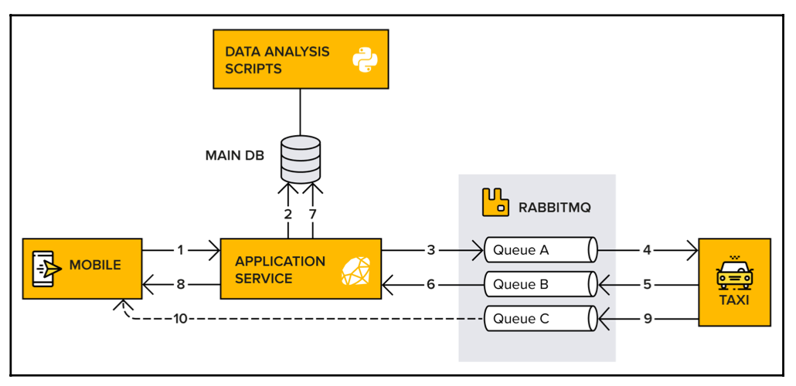

# Main Application Architecture

1. A customer uses CC's mobile application to book a taxi. A request is now sent from the mobile application to the 
Application Service. This request includes information about the trip that the customer wants to book.
2. The Application Service stores the request in a database.
3. The Application Service adds a message with information about the trip to a queue in RabbitMQ.
4. Connected taxi cars subscribe to the message (the booking request).
5. A taxi responds to the customer by sending a message back to RabbitMQ.
6. The Application Service subscribes to the messages.
7. Again, the Application Service stores the information in a database.
8. The Application Service forwards the information to the customer.
9. The taxi app starts to automatically send the taxi's geographical location at a given interval to RabbitMQ.
10. The location of the taxi is then passed straight to the customer's mobile application, via WebSockets, so that 
they know when the taxi arrives.